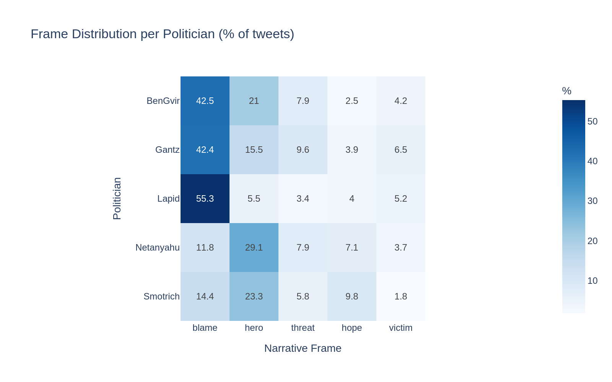
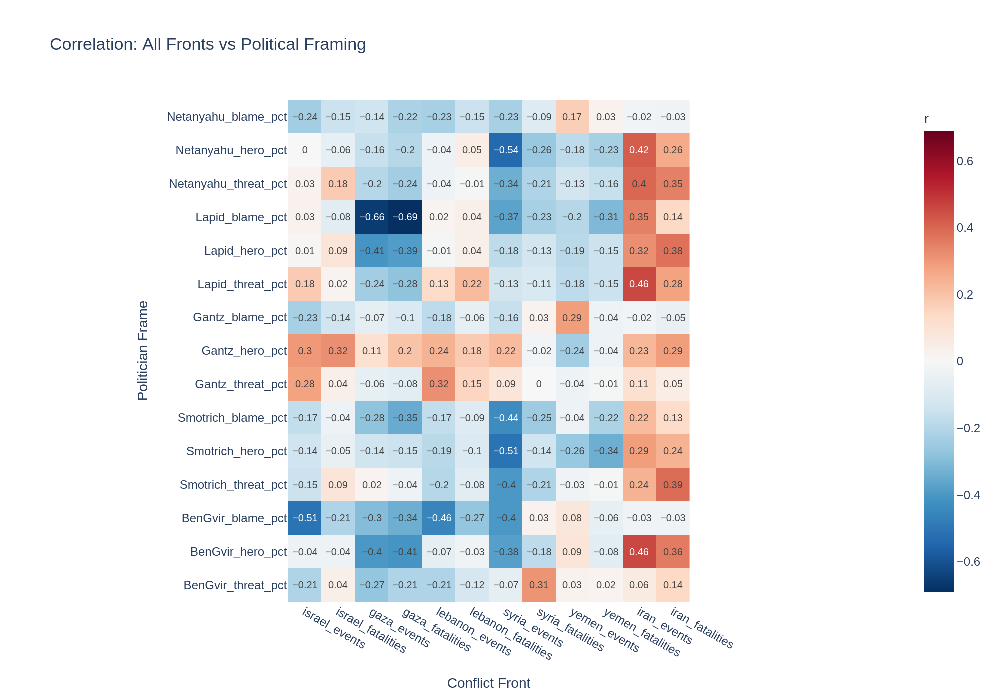
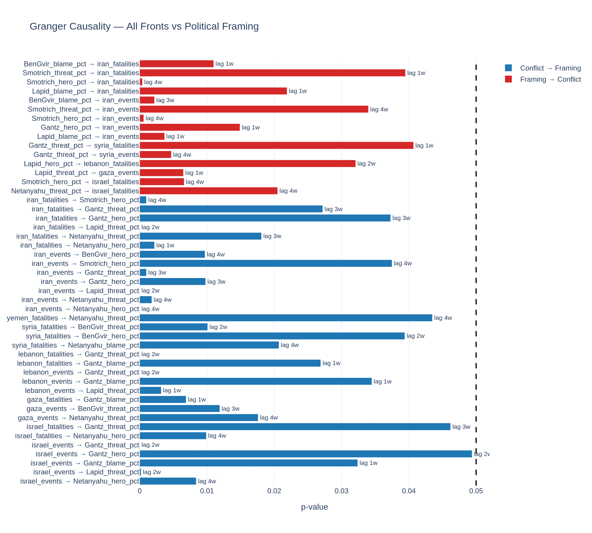
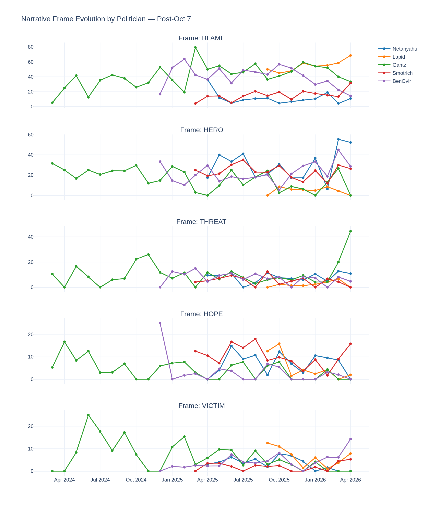

# 🇮🇱 Framing the Multi-Front War
### Computational Analysis of Israeli Political Discourse on X/Twitter (2024–2026)

[](https://python.org)
[](https://colab.research.google.com)
[](LICENSE)
[](https://acleddata.com)
[](https://openai.com)

---

## Overview

This project presents a full end-to-end computational pipeline for analyzing how Israeli politicians frame the multi-front war on X/Twitter (formerly Twitter), and how their discourse relates to real-world conflict events across six war fronts.

**Politicians analyzed:**
| Politician | Party | Position |
|---|---|---|
| Benjamin Netanyahu | Likud | Prime Minister |
| Yair Lapid | Yesh Atid | Opposition Leader |
| Benny Gantz | National Unity | Opposition (former War Cabinet) |
| Bezalel Smotrich | Religious Zionism | Finance Minister |
| Itamar Ben Gvir | Otzma Yehudit | National Security Minister |

**War fronts covered:** Gaza · Lebanon · Syria · Yemen · Iran · Israel

---
## Visualizations

### Frame Distribution


### Correlation: All Fronts vs Framing


### Granger Causality


### Framing Evolution Over Time


## Key Findings

- **Blame (32%)** is the dominant narrative frame across all politicians
- **Lapid** is the strongest blame framer (55.3%) — consistent with opposition role
- **Netanyahu** leads in hero framing (29.1%) — governing narrative strategy
- **Conflict drives framing** — Granger causality is predominantly unidirectional
- **Iran front exception** — far-right framing (Ben Gvir, Smotrich) predicts Iran escalation
- **Opposition response lag:** 1–2 weeks · **Netanyahu response lag:** 4 weeks
- **Ben Gvir** occupies a uniquely isolated discursive space from all other politicians

---

## Pipeline

```
Module 1 → Module 2 → Module 3 → Module 4 → Module 5 → Module 6 → Module 7
  Data      Annotate   Analyze   Evaluate   Conflict  Correlate   Granger
Collection   GPT-4o    BERTopic   Cohen's κ   ACLED    Pearson r  Causality
```

| Module | Description | Tool |
|---|---|---|
| 1 | Tweet collection | X API v2 + Tweepy |
| 2 | LLM annotation (stance + frame) | GPT-4o |
| 3 | Topic modeling, framing, embeddings | BERTopic + PCA |
| 4 | Evaluation + bias audit | Cohen's κ + VADER |
| 5 | Conflict data collection | ACLED |
| 6 | Correlation analysis | Pearson r |
| 7 | Granger causality | statsmodels |

---

## Repository Structure

```
framing-the-war/
│
├── notebooks/
│   └── full_pipeline.ipynb          # Main Colab notebook (all 7 modules)
│
├── data/
│   └── README.md                    # Instructions for obtaining datasets
│
├── outputs/
│   └── README.md                    # Description of output files
│
├── paper/
│   └── israeli_political_discourse_paper.docx   # Full journal article draft
│
├── .env.example                     # API key template
├── requirements.txt                 # Python dependencies
├── LICENSE                          # MIT License
└── README.md                        # This file
```

---

## Setup

### 1. Clone the repository
```bash
git clone https://github.com/n3ra96/framing-the-war.git
```

### 2. Open in Google Colab
Upload `notebooks/full_pipeline.ipynb` to Google Colab or open directly via the Colab GitHub integration.

### 3. Set up API keys
In the Colab **Secrets panel** (🔑 key icon on the left sidebar), add:

| Secret Name | Description | Where to get it |
|---|---|---|
| `BEARER_TOKEN` | X API v2 Bearer Token | [developer.twitter.com](https://developer.twitter.com) |
| `OPENAI_API_KEY` | OpenAI API key | [platform.openai.com](https://platform.openai.com) |

> ⚠️ **Never hardcode API keys in the notebook.** Always use Colab Secrets.

### 4. Mount Google Drive
Run the Drive mount cell at the top of the notebook. All outputs will be saved to:
```
My Drive/pol_discourse/
```

### 5. Get conflict data
Download the ACLED Middle East aggregated dataset from [acleddata.com](https://acleddata.com) (free registration required) and upload it when prompted in Module 5.

---

## Costs

| Item | Cost |
|---|---|
| X API credits | \$17 |
| OpenAI GPT-4o annotation | \$6 |
| ACLED data | Free |
| **Total** | **\$23** |

---

## Outputs

After running the full pipeline, the following files will be saved to Google Drive:

**Data files:**
- `corpus.parquet` — Raw collected tweets
- `corpus_annotated.parquet` — Tweets with GPT-4o stance + frame labels
- `master_weekly_expanded.parquet` — Merged tweet + conflict data (all fronts)
- `granger_all_fronts.csv` — Full Granger causality results

**Visualizations (interactive HTML):**
- `topics_over_time.html` — BERTopic temporal topic chart
- `framing_shift.html` — Frame evolution per politician over time
- `frame_heatmap.html` — Frame distribution heatmap
- `ideology_trajectories.html` — PCA ideology space trajectories
- `correlation_all_fronts.html` — Multi-front correlation heatmap
- `granger_all_fronts_viz.html` — Full Granger causality chart

---

## Annotation Schema

**Stance** (toward the war/military operation):
- `support` — endorses or justifies the military operation
- `oppose` — criticizes the war effort or government handling
- `neutral` — informational, ceremonial, or unrelated

**Narrative Frame:**
- `blame` — assigns responsibility or fault
- `hero` — portrays actors as brave or righteous
- `threat` — frames existential danger
- `hope` — expresses positive future outcomes
- `victim` — highlights civilian or hostage suffering
- `other` — none of the above

---

## Evaluation

| Metric | Score | Interpretation |
|---|---|---|
| Stance κ (GPT-4o vs Human) | 0.762 | Substantial agreement ✓ |
| Frame κ (GPT-4o vs Human) | 0.525 | Moderate agreement ✓ |
| VADER baseline κ | -0.108 | Near-random (confirms LLM superiority) |
| Annotation error rate | 0.1% | Excellent |

---

## Citation

If you use this pipeline or dataset in your research, please cite:

```bibtex
@misc{framing-the-war-2026,
  title     = {Framing the Multi-Front War: Computational Analysis of Israeli Political Discourse on X/Twitter},
  year      = {2026},
  note      = {Graduate Research Project},
  url       = {https://github.com/YOUR_USERNAME/framing-the-war}
}
```

Please also cite:
- **ACLED** for conflict data: [acleddata.com/citation](https://acleddata.com/citation)
- **BERTopic**: Grootendorst, M. (2022). arXiv:2203.05794
- **GPT-4o**: OpenAI (2024). GPT-4o technical report

---

## License

MIT License — see [LICENSE](LICENSE) for details.

---

## Acknowledgements

Conflict data provided by ACLED (Armed Conflict Location and Event Data).  
Tweet data collected via X API v2.  
Annotation powered by OpenAI GPT-4o.
